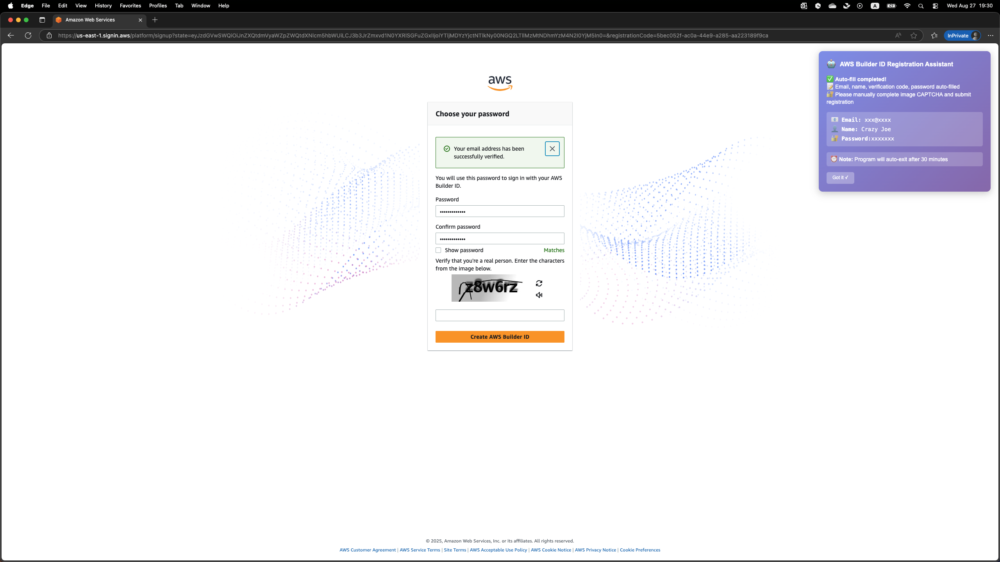

# Auto Builder Register

[](https://www.python.org/downloads/)
[](https://github.com/astral-sh/uv)
[](https://github.com/Hunter-Leo/auto-builder-register/issues)
[](https://github.com/Hunter-Leo/auto-builder-register/stargazers)
[](https://github.com/Hunter-Leo/auto-builder-register/network)

AWS Builder ID automatic registration tool with temporary email support

## Features

- ✅ Automatic temporary email generation (prioritizes .com domains)
- ✅ Automatic registration form filling
- ✅ Automatic email verification code handling
- ✅ Stop automation before graphical captcha
- ✅ Support for Edge browser
- ✅ Smart registration information caching (only saves successful registrations)
- ✅ Session restore functionality (recover expired email sessions)
- ✅ Complete command line interface
- ✅ Rich configuration options
- ✅ Full email content display in restore mode

## Screenshot



*The tool automatically completes the registration process until the graphical captcha step*

## Installation

### Prerequisites

Make sure you have [uv](https://docs.astral.sh/uv/getting-started/installation/) installed on your system.

### Install from Source (Development)

```bash
git clone https://github.com/Hunter-Leo/auto-builder-register.git
cd auto-builder-register
uv sync
uv build
uv pip install -e .
```

### Install as Tool (Recommended for Users)

```bash
# Install directly from repository
uv tool install git+https://github.com/Hunter-Leo/auto-builder-register.git

# Upgrade to latest version
uv tool upgrade auto-builder-register
```

### Alternative Installation Methods

#### Using pip (Traditional)

```bash
git clone https://github.com/Hunter-Leo/auto-builder-register.git
cd auto-builder-register
pip install -e .
```

#### Using uvx (Run without Installation)

```bash
# Run directly without installing
uvx --from auto-builder-register auto-register-aws-builder --help
```

### Usage Examples

You can directly use the `auto-register-aws-builder` command after installation with any of the above methods.

```bash
# Basic usage (automatically generate temporary email)
auto-register-aws-builder register

# Specify email and name
auto-register-aws-builder register --email test@example.com --name "John Doe"

# Use Edge browser (default)
auto-register-aws-builder register --browser edge

# Enable debug mode
auto-register-aws-builder register --debug

# View registration records
auto-register-aws-builder list-records

# Restore expired email sessions and monitor emails
auto-register-aws-builder sessions --restore

# View help
auto-register-aws-builder --help
```

## Modules

### AWS Builder ID Auto Registration Tool

AWS Builder ID automatic registration command-line tool based on Selenium and DropMail.

#### Command Line Options

```bash
# register command options
--email, -e          📧 Specify email address (optional, auto-generate temp email if not provided)
--name, -n           👤 User name (default: "Crazy Joe")
--password, -p       🔐 Specify password (default: "CrazyJoe@2025")
--headless           👻 Use headless mode
--browser, -b        🌐 Browser type (edge, default: edge)
--timeout, -t        ⏱️ Operation timeout (10-300 seconds, default: 30)
--wait-minutes, -w   ⏳ Wait time for user operation (1-120 minutes, default: 30)
--cache-file, -c     💾 Cache file path (default: .cache/auto_register_aws_builder.csv)
--debug, -d          🐛 Enable debug mode
--no-temp-email      🚫 Don't use temporary email, requires manual email verification
```

### DropMail Temporary Email Module

Temporary email functionality module based on [dropmail.me](https://dropmail.me) API.

#### Features

- ✅ Get temporary email addresses
- ✅ Receive emails
- ✅ Send emails (via external SMTP server)
- ✅ Session management
- ✅ Multi-domain support
- ✅ Email waiting functionality

#### Quick Usage

```python
from auto_update_q.temp_mail import DropMail

# Create instance and get temporary email
dropmail = DropMail()
temp_email = dropmail.get_temp_email()
print(f"Temporary email: {temp_email}")

# Receive emails
mails = dropmail.get_mails()
for mail in mails:
    print(f"From: {mail.from_addr}, Subject: {mail.subject}")

# Wait for new email
new_mail = dropmail.wait_for_mail(timeout=60)
if new_mail:
    print(f"Received new email: {new_mail.subject}")
```

For detailed documentation, see [temp_mail module documentation](src/auto_update_q/temp_mail/README.md)

## Run Demos

```bash
# Run AWS Builder ID auto registration demo
uv run python demo_auto_register.py

# Run temporary email demo
uv run python src/auto_update_q/temp_mail/quick_demo.py

# Run tests
uv run python src/auto_update_q/temp_mail/test_dropmail.py
uv run python test/test_auto_register.py
uv run python test/test_cli.py
```

## Usage Instructions

### Registration Process

1. The tool will automatically create a temporary email (prioritizes .com domains)
2. Automatically fill registration form
3. Automatically handle email verification code
4. Stop automation before graphical captcha
5. User manually completes graphical captcha
6. Registration information automatically saved to CSV file (only on success)
7. Email session cached for future restore (only on success)

### Session Management

Use `sessions --restore` command to:
- View all cached email sessions (sorted by last used time)
- Restore expired email sessions using restore keys
- Monitor emails with full content display
- Access historical registration data

### Registration Records

Registration information is saved to `.cache/auto_register_aws_builder.csv` file, containing:
- Timestamp
- Email address
- Password
- Name
- Status

Email sessions are cached in `.cache/dropmail_sessions.json` for restore functionality.

## Development

Use uv to manage project dependencies:

```bash
# Install dependencies
uv sync

# Add new dependency
uv add package_name

# Run script
uv run python script.py

# Run command line tool
uv run auto-register-aws-builder --help
```

## Project Structure

```
auto-builder-register/
├── src/
│   └── auto_update_q/
│       ├── __init__.py
│       ├── auto_register.py          # Main command line tool
│       ├── aws_builder/              # AWS Builder registration module
│       │   ├── aws_builder.py        # Main registrar
│       │   ├── browser_manager.py    # Browser management
│       │   ├── captcha_handler.py    # Captcha handling
│       │   ├── form_handler.py       # Form handling
│       │   └── ...
│       └── temp_mail/                # Temporary email module
│           ├── dropmail.py
│           └── ...
├── test/                             # Test files
│   ├── test_auto_register.py
│   └── test_cli.py
├── .cache/                           # Cache directory
│   └── auto_register_aws_builder.csv
├── demo_auto_register.py             # Demo script
└── pyproject.toml                    # Project configuration
```
